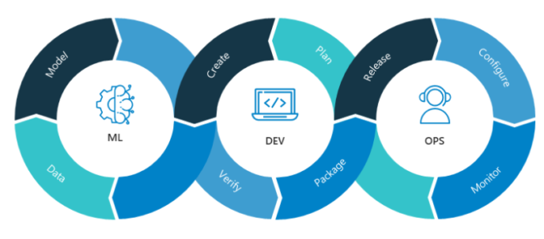

# <h1 align=center> **PROYECTO INDIVIDUAL** </h1>
# <h1 align=center>**`Machine Learning Operations (MLOps)`**</h1>

## <h2 align=center>**`Introducción y descripción del Proyecto`**</h2>

**¡Bienvenido/a a mi proyecto individual de Machine Learning Operations (MLOps)!**

En este proyecto, mi objetivo es llevar un modelo de recomendación que he desarrollado en un entorno de Data Science al mundo real, abordando los desafíos del ciclo de vida completo de un proyecto de Machine Learning.

Imaginate esto: acabas de empezar a trabajar como Data Scientist en una emocionante start-up que se dedica a la agregación de plataformas de streaming. Tengo la oportunidad de crear mi primer modelo de Machine Learning que soluciona un problema de negocio crucial: un sistema de recomendación que aún no ha sido lanzado.

Pero aquí está la dura realidad: los datos con los que trabajo están lejos de ser ideales. Son anidados, no están transformados y carecen de procesos automatizados para mantenerse actualizados. Así que estoy empezando desde cero, asumiendo el rol de Data Engineer, para construir un MVP (Minimum Viable Product) y cerrar el proyecto con éxito.

## <h2 align=center>**`Proceso de Extracción, Transformación y Carga (ETL)`** </h2>

### En este proyecto, se nos asignaron tareas específicas de transformación de datos que fueron llevadas a cabo como parte del proceso de ETL. Puedes encontrar un detalle más completo de cómo se realizaron estas transformaciones en el archivo [ETL](https://github.com/Gabrielnm7/Proyecto-MLOps/blob/main/ETL.ipynb). A continuación, proporciono un breve resumen de las acciones realizadas:

+ **Desanidamiento de campos:** Algunos campos, como `belongs_to_collection`, `production_companies` y otros, estaban anidados en el dataset. Para poder integrarlos adecuadamente, se realizó un proceso de desanidamiento 

+ **Manejo de valores nulos**: Los campos `revenue` y `budget` presentaban valores nulos, los cuales fueron reemplazados por el número 0. Además, se eliminaron las filas con valores nulos en el campo `release date`.

+ **Formato de fechas:** Las fechas presentes en el dataset se ajustaron al formato AAAA-mm-dd. Además, se creó una nueva columna llamada `release_year`, donde se extrajo el año de la fecha de estreno.

+ **Cálculo de retorno de inversión:** Se creó una nueva columna denominada `return`, que representa el retorno de inversión calculado a partir de los campos `revenue` y `budget`. En caso de falta de datos para el cálculo, se asignó el valor 0

+ **Eliminación de columnas no utilizadas**: Se eliminaron las columnas que no serán utilizadas, **`video`**,**`imdb_id`**,**`adult`**,**`original_title`**,**`poster_path`** y **`homepage`**.

## <h2 align=center> **`Desarrollo de API`**</h2>

### En esta etapa del proyecto, se propone disponibilizar los datos de la empresa mediante el uso del framework FastAPI. Se han definido 6 funciones para los endpoints que serán consumidos en la API, cada una de ellas con un decorador `@app.get('/')`.

### A continuación, se detallan las funciones y las consultas que pueden realizarse a través de la API:

> 1. def **peliculas_idioma( *`Idioma`: str* )**:
>   + Esta función recibe como parámetro un idioma y devuelve la cantidad de películas producidas en ese idioma.
>   + Ejemplo de retorno: *`X` cantidad de películas fueron estrenadas en `idioma`*

> 2. def **peliculas_duracion( *`Pelicula`: str* )**:
>   + Se ingresa una pelicula. Debe devolver la duracion y el año.
>   + Ejemplo de retorno: *`X` . Duración: `x`. Año: `xx`*

> 3. def **franquicia( *`Franquicia`: str* )**:
>   + Se ingresa la franquicia, retornando la cantidad de peliculas, ganancia total y promedio
>   + Ejemplo de retorno: *La franquicia `X` posee `X` peliculas, una ganancia total de `x` y una ganancia promedio de `xx`*

> 4. def **peliculas_pais( *`Pais`: str* )**:
>   + Se ingresa un país, retornando la cantidad de peliculas producidas en el mismo.
>   + Ejemplo de retorno: *Se produjeron `X` películas en el país `X`*

> 5. def **productoras_exitosas( *`Productora`: str* )**:
>   + Se ingresa la productora, entregandote el revunue total y la cantidad de peliculas que realizo. 
>   + Ejemplo de retorno: *La productora `X` ha tenido un revenue de `x`*

> 6. def **get_director( *`nombre_director`* )**:
>   + Se ingresa el nombre de un director que se encuentre dentro de un dataset debiendo devolver el éxito del mismo medido a través del retorno. Además, deberá devolver el nombre de cada película con la fecha de lanzamiento, retorno individual, costo y ganancia de la misma, en formato lista.

## <h2 align=center> **`Análisis exploratorio de los datos`**: _(Exploratory Data Analysis-EDA)_ </h2>

Después de haber realizado la limpieza de los datos, llega el momento de investigar las relaciones existentes entre las variables de los datasets. Durante el EDA, exploraremos posibles patrones interesantes, detectaremos outliers o anomalías (que no necesariamente son errores) y, además, utilizaremos nubes de palabras para identificar las palabras más frecuentes en los títulos. ¡Esto podría resultar de gran ayuda para nuestro sistema de recomendación! 

Todo este proceso puede apreciarse de manera mas completa en el archivo [EDA.ipynb](https://github.com/Gabrielnm7/Proyecto-MLOps/blob/main/EDA.ipynb). Te invito a explorar dicho archivo para obtener una visión más completa de las etapas y técnicas utilizadas en nuestro análisis exploratorio.
 

## <h2 align=center>  **`Sistema de recomendación`**: </h2>

Una vez que hemos hecho que todos los datos sean consumibles a través de la API y que los departamentos de Analytics y Machine Learning tengan acceso a ellos, es hora de entrenar nuestro modelo de machine learning y construir un sistema de recomendación de películas. Este sistema se basa en recomendar películas a los usuarios en función de la similitud con otras películas. Para lograrlo, evaluaremos la similitud de calificaciones entre la película ingresada y el resto de las películas. Luego, ordenaremos las películas según su puntuación de similitud y devolveremos una lista en Python con los 5 valores más altos, cada uno representando el nombre de las películas con la puntuación más alta en orden descendente.

> def **recomendacion( *`titulo`* )**:
>    + Se ingresa el nombre de una película y te recomienda las similares en una lista de 5 valores.

Para ver en mas detalle sobre como se realizo, podemos acceder al archivo [modelo_recomendacion](https://github.com/Gabrielnm7/Proyecto-MLOps/blob/main/modelo_recomendacion.ipynb)

## <h2 align=center> **`Detalles adicionales del proyecto`**</h2>

+ [Deployment](https://proyecto-mlops-gabriel.onrender.com/docs#): El proyecto ha sido desplegado en un entorno en línea utilizando **`Render`**, lo que te permite acceder a la página y consultar todas las funciones de la aplicación. Puedes visitar el enlace a continuación para explorar y utilizar las funcionalidades:
[Acceder a la página web](https://proyecto-mlops-gabriel.onrender.com/docs#)

+ [Dataset original](https://drive.google.com/drive/folders/1nvSjC2JWUH48o3pb8xlKofi8SNHuNWeu): Carpeta con los 2 archivos con datos que requieren ser procesados (movies_dataset.csv y credits.csv)

+ [Diccionario de datos](https://docs.google.com/spreadsheets/d/1QkHH5er-74Bpk122tJxy_0D49pJMIwKLurByOfmxzho/edit#gid=0): Diccionario con algunas descripciones de las columnas disponibles en el dataset.

+ [Video explicativo]() Para que puedas entender en profundidad todo el proceso del proyecto y como funciona el sistema de recomendacion.